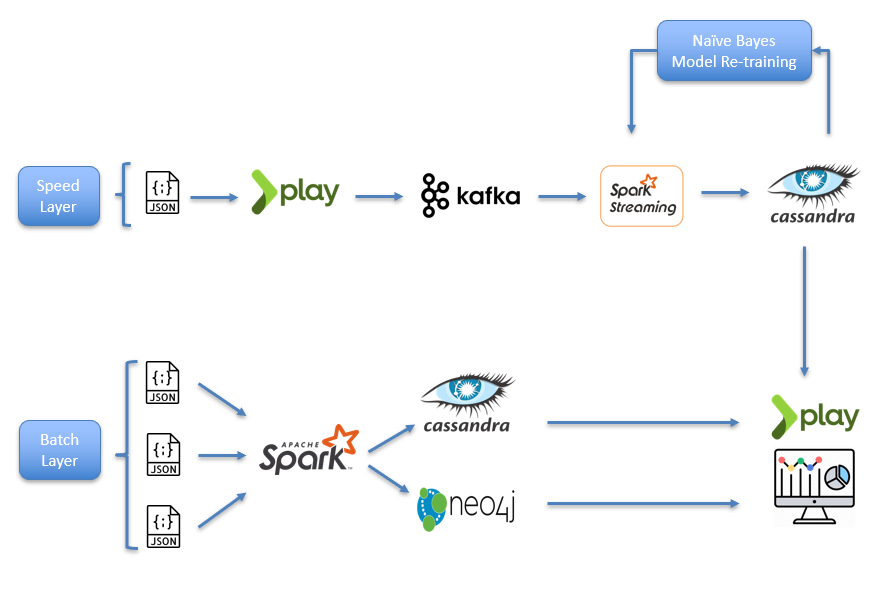

# Sentiment Analysis on Yelp Dataset 

Repo for CSYE7200 Big-Data Sys Engr Using Scala Final Project

Project: Sentiment Analysis on Yelp Dataset using Spark Structured Streaming and Kafka

Team members:

Keshav Vyas - vyas.ke@husky.neu.edu

Akshay Patel - patel.ak@husky.neu.edu

# Introduction
Sentiment Analysis
What's in a review? Is it positive or negative? Yelp's reviews contain a lot of metadata that can be mined and used to infer meaning, business attributes, and sentiment.

Graph Mining
How do user's relationships help us craft user-specific views.

Processing Data at Scale
Can you imagine manually sorting through millions customer reviews, ratings, suggestions(tips)? There’s just too much data to process manually. Sentiment analysis helps user to consolidate right data for a business.

# Architecture

Speed Layer: Speed Layer is responsible for continuously processing review data from Kafka stream. Spark structured streaming reads the kafka stream data, preprocess it for machine learning model, and classify the review text as positive or negative sentiment. Final results of speed layer loads into Cassandra continuously in append mode.

Batch Layer: Batch layer retrains Naive Bayes Model periodically as scheduled by Akka Scheduler. Batch layer creates user friends network graph into neo4j graph database. Batch Layer also facilitates aggregation of user review and its important details about sentiment and loads into Cassandra.

# Project Setup

## Run Kafka and Zookeeper
Navigate to the kafka directory and execute the following commands each in different cmd terminal:

1. bin/zookeeper-server-start.sh config/zookeeper.properties
2. bin/kafka-server-start.sh config/server.properties
3. bin/kafka-topics.sh --create --bootstrap-server localhost:9092 --replication-factor 1 --partitions 1 --topic ReviewTopic
4. bin/kafka-console-producer.sh --broker-list localhost:9092 --topic ReviewTopic

## Run Scala Project
Prerequisites:
Cassandra: version 3.11 https://www.apache.org/dyn/closer.lua/cassandra/3.11.6/
Zookeeper: https://zookeeper.apache.org/releases.html#download

Replace Data Directory of Cassandra and Zookeeper in resources/application.conf

Data: https://www.yelp.com/dataset

For ingesting business, user and checkin data: Replace directory for json files in resources/application.conf

Model saving:
Replace directory of trained model in resources/application.conf which will essentially use the model to predict sentiment
in realtime streaming data 

Model Retraining: 
Replace directory to save re-trained model in resources/application.conf

To Run Scala Application:
Run scala/main_package -> yelpSentimentMain.scala

## Run Play UI Project

Scala based Play UI framework is used in this project to trigger Kafka streams and send user review data over Kafka stream which can be consumed by Scala project mention in above section for sentiment analysis. UI build in play framework also shows results for all the use cased mention in this project.

Use Cases:
1. User selects a business id i.e. Restaurant, Home Service and gets sentiment analysis of that business.
2. User selects a category and Location and gets top trending businesses.
3. User choose User id and Business Id and top 5 positive and negative reviews along with user's friend's review who visited that place before along with their review.

Data:
For ingesting user review data: Replace directory path for json file in conf/application.conf and add topic name

Open Itellij and Run Scala Play framework which open open below showened page:

Use Case 1 & 3:

Use Case 2:

